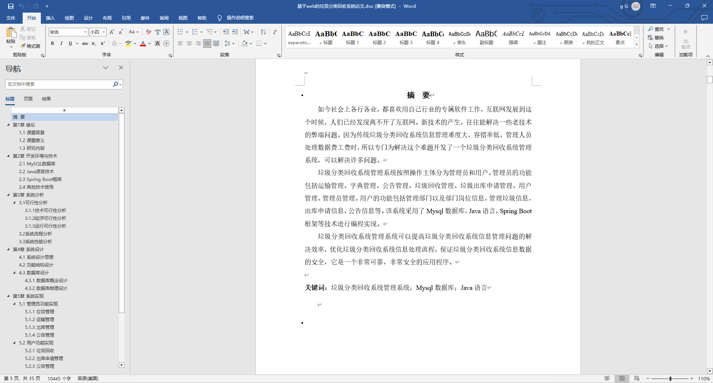
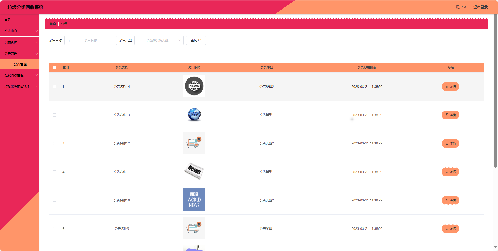
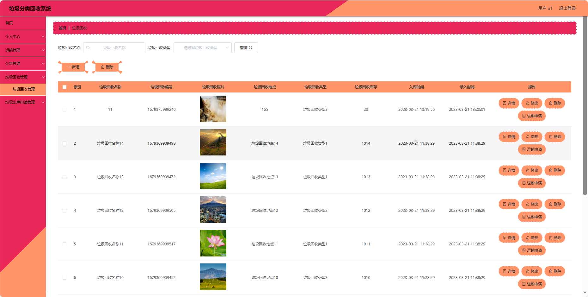
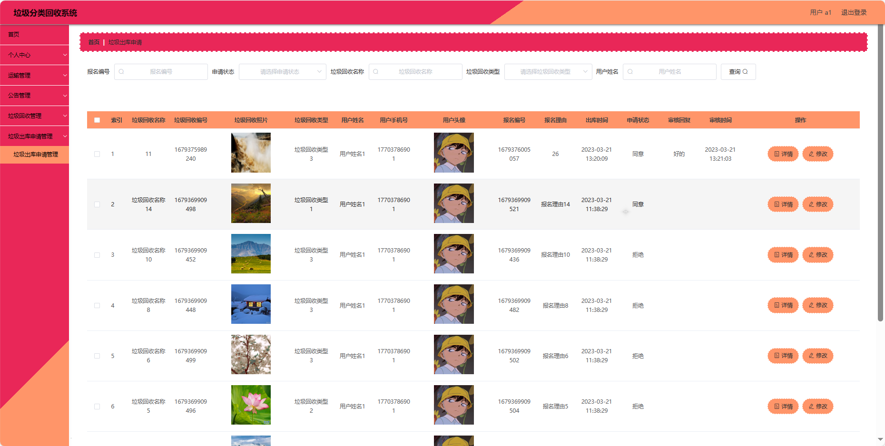
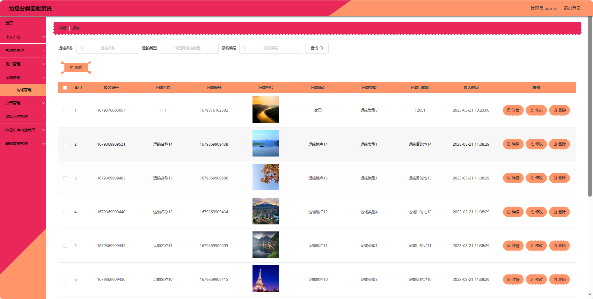
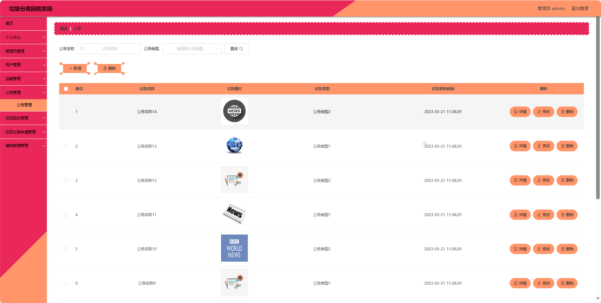
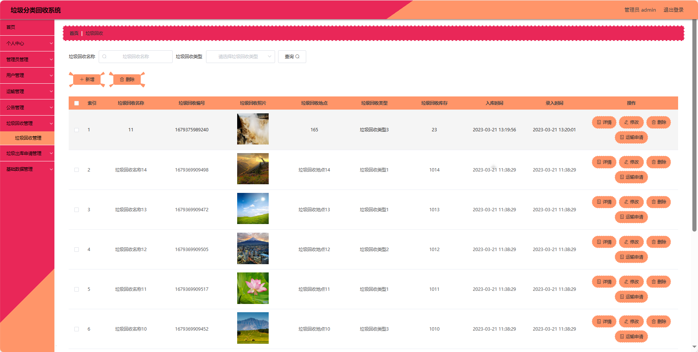
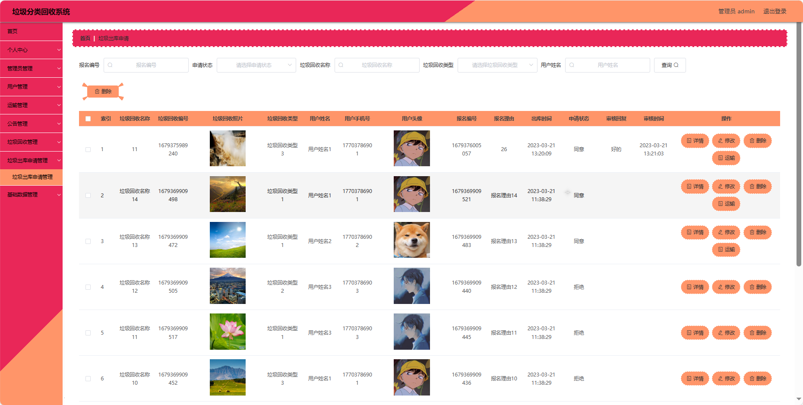
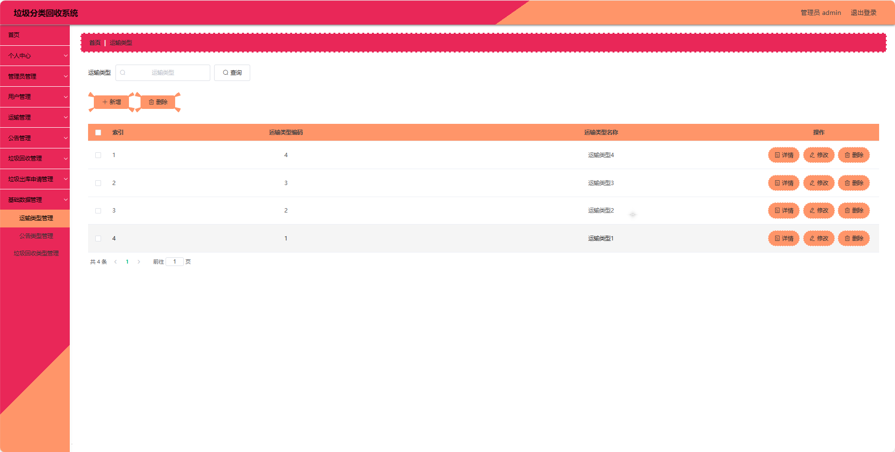

## 基于SpringBoot的垃圾分类回收系统(程序+报告)

###  获取sql数据库文件: 从戎源码网 (https://armycodes.com/) QQ: 386869957 QQ群: 377586148
###  所有系统地址: (https://github.com/YuLin-Coder/AllProjectCatalog) 
###  所有项目以及源代码本人均调试运行无问题 可支持远程安装部署调试、定制修改、代码讲解

## 项目介绍
基于SpringBoot的垃圾分类回收系统，系统包含两种角色：管理员、用户主要功能如下。

### 【管理员】:
首页：查看垃圾分类回收系统。
个人中心：管理个人信息。
管理员管理：审核和管理注册管理员用户的信息。
用户管理：审核和管理注册用户的信息。
运输管理：监管和管理系统中的运输信息。
公告管理：发布、编辑和删除系统的通知和公告。
垃圾回收管理：监管和管理垃圾回收的信息。
垃圾出库申请管理：审批和管理用户提交的垃圾出库申请。
基础数据管理：管理系统的基础数据，运输类型、公告类型和垃圾回收类型。

### 【用户】:
首页：浏览垃圾分类回收系统信息。
个人中心：管理个人信息，查看历史记录和订单状态。
运输管理：查看运输信息，垃圾回收的时间和地点。
公告管理：阅读系统发布的相关通知和公告。
垃圾回收管理：查看垃圾回收的信息，回收类型和进度。
垃圾出库申请管理：提交和查看垃圾出库申请的状态。

## 项目技术
- 编程语言：Java
- 数据库：MySQL
- 项目管理工具：Maven
- 前端技术：HTML、CSS、JavaScript、Jquery、Vue
- 后端技术：Spring、SpringMVC、MyBatis

## 运行环境
- JDK版本：JDK1.8及以上
- 开发工具：IDEA、Ecplise、Myecplise都可以
- 数据库: MySQL5.7及以上
- Maven：maven3.0及以上
- Node：14.14.0及以上

## 运行截图

